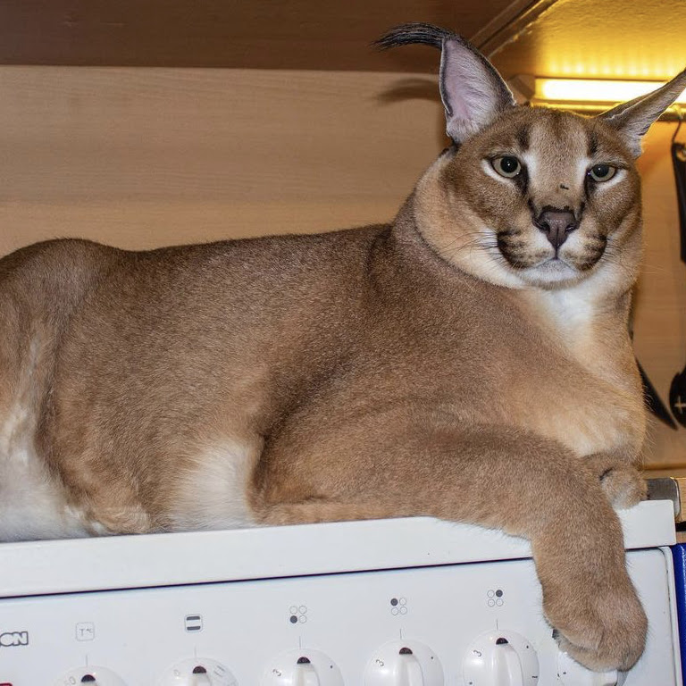

## Knowlege
 - HTML/CSS/JS (meh)
 - Java (sort of)'
 - C / C++ (kinda)
 - Rust (eh)

## Current Projects
**Oxide Gambit** - chess is hard who knew

## Floppa Shrine

`
All hail lord flop, their judgement stands above all others, their presence a shining beacon of light in a hopeless dark world. May their wisdom may guide us all to a brighter happier future. May their eternal existence bring sanctity and comfort through the most troubling of times. May their radiant glory ease the sick and improve the lives of everyone who it comes into contact with. May the, nay, our great lord flop shower us with gifts beyond our imagining with stoic indifference and humility. All hail lord flop.
`

## Military-Grade Gunpowder
https://pastebin.com/ch9cwkin
<!--
**aspiringLich/aspiringLich** is a ✨ _special_ ✨ repository because its `README.md` (this file) appears on your GitHub profile.

Here are some ideas to get you started:

- 🔭 I’m currently working on ...
- 🌱 I’m currently learning ...
- 👯 I’m looking to collaborate on ...
- 🤔 I’m looking for help with ...
- 💬 Ask me about ...
- 📫 How to reach me: ...
- 😄 Pronouns: ...
- ⚡ Fun fact: ...
-->
